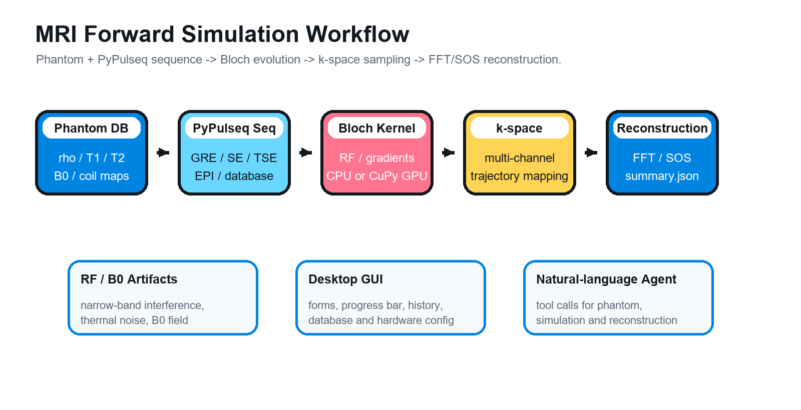
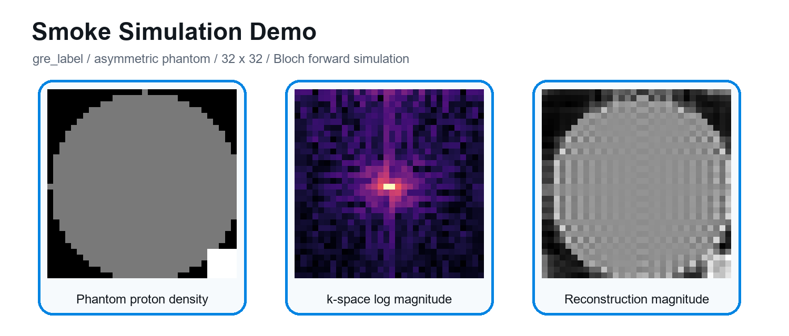

[]()

<p align="left">
	
</p>

#### 面向 PyPulseq/Bloch 方程的磁共振成像前向模拟、伪影建模与智能代理工作台

<p align="left">
	
	
	
	
</p>
<p align="left">
		<em>_Built with:_</em>
</p>
<p align="left">
	
	
	
	
	
	
</p>
<br>

## 🔗 Table of Contents

I. [📰 News](#-news)  
II. [📍 Overview](#-overview)  
III. [👁️ Features](#️-features)  
IV. [📂 Project Structure](#-project-structure)  
V. [🚀 Getting Started](#-getting-started)  
VI. [📌 Project Roadmap](#-project-roadmap)  
VII. [🔰 Contributing](#-contributing)  
VIII. [🎗 License](#-license)  
IX. [🙏 Acknowledgments](#-acknowledgments)

---

## 📰 News

- **2026-06-20** 🧭 添加模拟进度回调与 CuPy 禁用模式：CLI/GUI 可输出结构化进度，支持在 GPU 兼容性或显存受限时强制使用 NumPy/CPU。
- **2026-06-20** 🖥️ 新增本地桌面 GUI：用 Tkinter 提供体模、序列、伪影、数据库、硬件配置和结果浏览的一体化窗口工作流。
- **2026-06-20** 📚 新增序列数据库管理：支持导入、列出、删除 PyPulseq `.seq` 文件，并可通过 `--sequence database` 参与模拟。
- **2026-06-20** ⚙️ 接入硬件配置系统：通过 `.env` / 环境变量统一管理 `MRI_SYSTEM_*` 梯度、slew、RF dead time 与 ADC dead time 参数。
- **2026-06-20** 🔁 增加 TSE 序列支持：补充 turbo spin echo 序列生成、CLI 参数与文档说明。
- **2026-06-19** 🧩 新增体模数据库管理：支持创建体模条目、导入 `rho/t1/t2/dB0/coil map` 等数组、加载数据库体模并删除条目。
- **2026-05-02** 💬 新增 Streamlit 交互界面：提供基于自然语言的 MRI 仿真工作流可视化入口。
- **2026-04-18** 🤖 建立 ReAct 智能代理：支持调用体模生成、数据库加载、前向模拟和图像重建工具。
- **2026-04-13** 🧲 新增 MRI 伪影对比可视化工具：用于观察 RF/B0 等伪影对重建结果的影响。
- **2026-04-11** 🧠 新增 Bloch 方程求解器：引入核心 Bloch 更新工具，为前向模拟提供物理演化基础。
- **2026-04-08** 📡 新增 RF 与 B0 伪影建模：支持射频干扰、背景噪声和主磁场不均匀场图生成。
- **2026-04-07** ⚡ 添加 GPU 加速支持：引入设备管理层，在 CuPy 可用时自动使用 GPU，否则回退 CPU。
- **2026-04-05** 🧪 新增标准自旋回波序列：补充笛卡尔 spin echo 采集链路。
- **2026-04-05** 🚀 初始化 MRI 模拟框架：建立体模、序列、Bloch 模拟、重建和测试基础结构。

---

## 📍 Overview

MRI Forward Simulation 是一个磁共振成像前向模拟项目，围绕 **体模构建、PyPulseq 序列生成、Bloch 方程演化、k-space 采样、FFT/SOS 图像重建、RF/B0 伪影建模** 组织完整工作流。

项目根目录唯一 Python 用户入口是 [`main.py`](main.py)。你可以通过同一个入口运行命令行模拟、本地桌面 GUI、命令行智能代理和 Streamlit 智能代理界面。

<p align="center">
	
</p>

---

## 👁️ Features

|      | Feature | Summary |
| :--- | :---: | :--- |
| 🧲 | **Forward Simulation** | <ul><li>基于 PyPulseq block 逐块解析序列事件。</li><li>RF/ADC block 使用细时间步 Bloch 数值积分。</li><li>无 RF/ADC block 使用梯度面积和弛豫闭式更新。</li></ul> |
| 🧬 | **Phantom System** | <ul><li>内置 asymmetric、sphere、ring 体模。</li><li>支持 `(Nz, Nx, Ny)` 与 `(TypeNum, SpinNum, Nz, Nx, Ny)` 数组。</li><li>支持 T1/T2、质子密度、B0、化学位移、随机离共振和线圈灵敏度图。</li></ul> |
| 📡 | **Sequence Library** | <ul><li>支持 `gre`、`gre_label`、`se`、`tse`、`epi`、`epi_se`、`epi_label`。</li><li>支持体模几何与序列采样矩阵分离。</li><li>可从本地序列数据库加载外部 `.seq` 文件。</li></ul> |
| 🧾 | **Database Management** | <ul><li>体模数据库支持 create / load / list / delete。</li><li>序列数据库支持 `.seq` 导入、读取、删除和索引说明。</li><li>数据库目录保留在 `mri_sim/phantom_depository/` 与 `mri_sim/seq_depository/`。</li></ul> |
| 🖼️ | **Reconstruction** | <ul><li>基于 k-space 轨迹映射的 3D Cartesian FFT 重建。</li><li>兼容单通道和多通道信号。</li><li>支持多通道 coil image 的 SOS 合并。</li></ul> |
| ⚠️ | **Artifacts** | <ul><li>支持窄带 RF 干扰、背景热噪声和非相干相位扰动。</li><li>支持线性或抛物线 B0 不均匀场。</li><li>数据库体模已有 `dB0.npy` 时可直接进入模拟。</li></ul> |
| ⚡ | **CPU/GPU Backend** | <ul><li>CuPy 可用时自动使用 GPU 加速核心数组计算。</li><li>无 GPU 或 CuPy 不可用时自动回退 NumPy/CPU。</li><li>`--cupy-mode disabled` 可显式禁用 CuPy。</li></ul> |
| 🖥️ | **Interfaces** | <ul><li>CLI 覆盖完整模拟与数据库管理。</li><li>Tkinter GUI 支持表单、进度条、结果历史和硬件配置。</li><li>ReAct Agent 与 Streamlit UI 支持自然语言驱动模拟流程。</li></ul> |

<p align="center">
	
</p>

---

## 📂 Project Structure

```sh
└── mri_codex/
    ├── .env.example
    ├── README.md
    ├── readme-example.md
    ├── readme1.md
    ├── requirements.txt
    ├── main.py
    ├── assets/
    │   └── readme/
    │       ├── logo.png
    │       ├── title.png
    │       ├── workflow.png
    │       └── demo-result.png
    ├── agent/
    │   ├── react_agent.py
    │   ├── streamlit_app.py
    │   └── tools/
    ├── mri_sim/
    │   ├── bloch_kernel.py
    │   ├── device_manager.py
    │   ├── generate_artifact.py
    │   ├── gui_app.py
    │   ├── phantom.py
    │   ├── phantom_database.py
    │   ├── recon.py
    │   ├── sequence_database.py
    │   ├── simulate.py
    │   ├── system_config.py
    │   ├── sequences/
    │   ├── phantom_depository/
    │   └── seq_depository/
    └── output/
```

### 📇 Project Index

<details open>
	<summary><b><code>MRI_CODEX/</code></b></summary>
	<details>
		<summary><b>__root__</b></summary>
		<blockquote>
			<table>
			<tr>
				<td><b><a href="main.py">main.py</a></b></td>
				<td>项目统一入口，负责 CLI 参数解析、体模/序列构建、完整模拟管线、数据库命令、GUI 和 Agent 启动。</td>
			</tr>
			<tr>
				<td><b><a href="requirements.txt">requirements.txt</a></b></td>
				<td>声明 NumPy、Matplotlib、PyPulseq、tqdm、nibabel、requests、Streamlit 等核心运行依赖。</td>
			</tr>
			<tr>
				<td><b><a href=".env.example">.env.example</a></b></td>
				<td>提供智能代理模型配置和 MRI_SYSTEM_* 硬件参数示例。</td>
			</tr>
			</table>
		</blockquote>
	</details>
	<details>
		<summary><b>mri_sim</b></summary>
		<blockquote>
			<table>
			<tr>
				<td><b><a href="mri_sim/simulate.py">simulate.py</a></b></td>
				<td>实现 block-driven Bloch 前向模拟、进度回调、快速路径/精细路径路由和 ADC 信号采集。</td>
			</tr>
			<tr>
				<td><b><a href="mri_sim/bloch_kernel.py">bloch_kernel.py</a></b></td>
				<td>提供 Bloch 单步更新、离共振项构建、发射场合成，以及兼容旧接口的 BlochKernel 包装。</td>
			</tr>
			<tr>
				<td><b><a href="mri_sim/phantom.py">phantom.py</a></b></td>
				<td>定义 Phantom 类和基础体模生成器，支持组织参数、线圈灵敏度和空间坐标网格。</td>
			</tr>
			<tr>
				<td><b><a href="mri_sim/recon.py">recon.py</a></b></td>
				<td>实现 k-space 到 Cartesian 网格的映射、3D FFT 重建、多通道重建和 SOS 合并。</td>
			</tr>
			<tr>
				<td><b><a href="mri_sim/generate_artifact.py">generate_artifact.py</a></b></td>
				<td>生成 RF 干扰、背景噪声和 B0 不均匀场，用于伪影模拟。</td>
			</tr>
			<tr>
				<td><b><a href="mri_sim/gui_app.py">gui_app.py</a></b></td>
				<td>本地 Tkinter GUI，覆盖模拟配置、数据库管理、硬件配置、进度显示和结果浏览。</td>
			</tr>
			</table>
		</blockquote>
	</details>
	<details>
		<summary><b>agent</b></summary>
		<blockquote>
			<table>
			<tr>
				<td><b><a href="agent/react_agent.py">react_agent.py</a></b></td>
				<td>ReAct 风格智能代理，按工具调用体模生成、数据库加载、前向模拟和图像重建。</td>
			</tr>
			<tr>
				<td><b><a href="agent/streamlit_app.py">streamlit_app.py</a></b></td>
				<td>Streamlit 交互界面，展示聊天、执行轨迹、体模、k-space 和重建结果。</td>
			</tr>
			</table>
		</blockquote>
	</details>
</details>

---

## 🚀 Getting Started

### ☑️ Prerequisites

Before getting started with MRI Forward Simulation, ensure your runtime environment meets the following requirements:

- **Programming Language:** Python 3.10+
- **Package Manager:** pip
- **Sequence Engine:** PyPulseq
- **Optional Acceleration:** CuPy + CUDA
- **Optional Agent API:** OpenAI-compatible chat completion endpoint

### ⚙️ Installation

Install MRI Forward Simulation from source:

1. Clone the repository:

```sh
git clone https://github.com/lupin182/mri_simulation
```

2. Navigate to the project directory:

```sh
cd mri_simulation
```

3. Create and activate a virtual environment:

```powershell
python -m venv .venv
.\.venv\Scripts\Activate.ps1
```

4. Install dependencies:

```powershell
pip install -r requirements.txt
```

### 🧰 Configuration

Copy `.env.example` to `.env` when you need hardware or agent configuration:

```powershell
Copy-Item .env.example .env
```

Recommended hardware defaults:

```text
MRI_SYSTEM_MAX_GRAD=32
MRI_SYSTEM_GRAD_UNIT=mT/m
MRI_SYSTEM_MAX_SLEW=130
MRI_SYSTEM_SLEW_UNIT=T/m/s
MRI_SYSTEM_RF_RINGDOWN_TIME=20e-6
MRI_SYSTEM_RF_DEAD_TIME=100e-6
MRI_SYSTEM_ADC_DEAD_TIME=10e-6
```

### 🤖 Usage

Run the default full forward simulation:

```powershell
python main.py
```

Run an explicit GRE-label simulation:

```powershell
python main.py simulate --sequence gre_label --phantom asymmetric --nx 64 --ny 64
```

Use separate phantom and sequence geometry:

```powershell
python main.py simulate --phantom asymmetric --nx 128 --ny 128 --sequence gre_label --seq-nx 64 --seq-ny 64
```

Disable CuPy and force NumPy/CPU:

```powershell
python main.py simulate --cupy-mode disabled
```

Run RF artifact simulation:

```powershell
python main.py simulate --rf-artifact --rf-noise-freq 127700000 --rf-noise-amp 5.0 --bg-noise-amp 1.0
```

Run B0 inhomogeneity simulation:

```powershell
python main.py simulate --b0-artifact --b0-mode linear --b0-delta-ppm 0.5 --b0-axis x
```

Start the local desktop GUI:

```powershell
python main.py gui
```

Start the command-line agent:

```powershell
python main.py agent-cli
```

Start the Streamlit agent UI:

```powershell
python main.py agent-ui
```

### 🗃️ Database Commands

List, create, load and delete phantom database entries:

```powershell
python main.py simulate database list
python main.py simulate database create --name brain_demo --description "Brain phantom with coil maps"
python main.py simulate database load --name brain_demo --data rho --file-path E:\data\rho.npy
python main.py simulate database delete --name brain_demo --all
```

Manage imported PyPulseq `.seq` files:

```powershell
python main.py simulate sequence-database list
python main.py simulate sequence-database load --name my_gre --description "Imported GRE sequence" --file-path E:\data\my_gre.seq
python main.py simulate sequence-database delete --name my_gre
```

Run a database sequence:

```powershell
python main.py simulate --sequence database --sequence-name my_gre --phantom asymmetric --nx 64 --ny 64
```

### 🧪 Testing

Run static parsing over all Python files:

```powershell
python -c "import ast, pathlib; [ast.parse(p.read_text(encoding='utf-8')) for p in pathlib.Path('.').rglob('*.py')]; print('ok')"
```

Run a small smoke simulation:

```powershell
python main.py simulate --sequence gre_label --phantom asymmetric --nx 8 --ny 8 --fine-dt 1e-5 --no-plot
```

---

## 📌 Project Roadmap

- [X] **`Core Simulation`**: <strike>建立体模、PyPulseq 序列、Bloch 演化、k-space 采样和重建主链路。</strike>
- [X] **`Database Workflow`**: <strike>加入体模数据库和序列数据库管理能力。</strike>
- [X] **`Local Interfaces`**: <strike>提供 CLI、Tkinter GUI、ReAct agent 和 Streamlit UI。</strike>
- [ ] **`Validation Suite`**: 扩展自动化测试，覆盖更多序列、伪影和多通道重建场景。
- [ ] **`Performance Benchmarks`**: 系统记录 CPU/CuPy 后端在不同矩阵规模下的性能。
- [ ] **`Documentation Assets`**: 补充更多真实 MRI 序列和数据库体模示例。

---

## 🔰 Contributing

- **💬 Discussions:** 欢迎围绕序列设计、物理模型、重建链路和 GUI/Agent 体验提出建议。
- **🐛 Issues:** 如果发现模拟结果异常、参数不生效、GUI 卡顿或数据库读写问题，请提交最小复现命令。
- **🧪 Pull Requests:** 推荐在 PR 中附带运行命令、输出摘要和必要的图像对比。

<details closed>
<summary>Contributing Guidelines</summary>

1. **Fork the Repository**: Fork this project to your own GitHub account.
2. **Clone Locally**: Clone your fork to your local machine.
   ```sh
   git clone https://github.com/lupin182/mri_simulation
   ```
3. **Create a New Branch**: Use a descriptive branch name.
   ```sh
   git checkout -b feature/new-sequence
   ```
4. **Make Your Changes**: Keep changes scoped and document new user-facing behavior.
5. **Run Checks**: At minimum, run static parsing and a small smoke simulation.
6. **Commit Your Changes**: Write a clear commit message.
   ```sh
   git commit -m "feat: add new MRI sequence"
   ```
7. **Push to GitHub**:
   ```sh
   git push origin feature/new-sequence
   ```
8. **Submit a Pull Request**: Describe the motivation, implementation, and verification.
</details>

<details closed>
<summary>Contributor Graph</summary>
<br>
<p align="left">
   <a href="https://github.com/lupin182/mri_simulation/graphs/contributors">
      
   </a>
</p>
</details>

---

## 🎗 License

This project is protected under the MIT License.

---

## 🙏 Acknowledgments

- PyPulseq provides the sequence construction foundation used by this project.
- NumPy, Matplotlib and Streamlit support the numerical, visualization and interactive UI workflows.
- The README layout follows the visual structure of the local `readme-example.md` reference.

---
